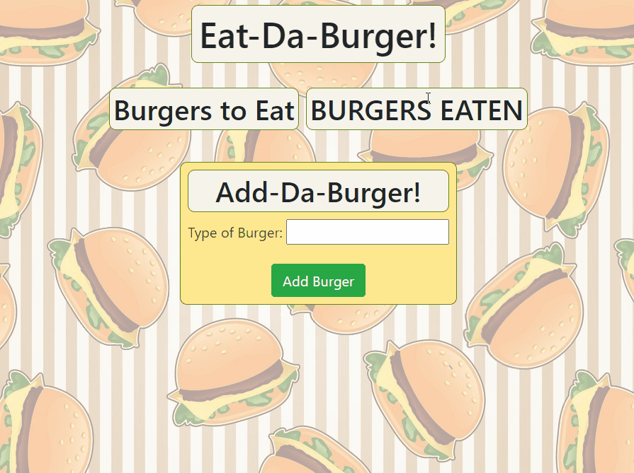

# [BurgerBase](https://fathomless-citadel-38635.herokuapp.com/)

[](https://opensource.org/licenses/MIT)

## Table of Contents
* [Description](#Description)
  * [Further Possibilities](#Further-Possibilities)
  * [Built With](#built-with)
* [Installation](#Installation)
* [Usage](#Usage)
* [License](#License)
* [Contributing](#Contributing)
* [Questions](#Questions)

## Description
A burger-logging demonstration of MySQL, Node, Express, Handlebars, and ORM utilization. The user's list of burgers is kept in a MySQL database to persist across sessions. By using Handlebars, we can dynamically render a more pleasant interface to interact with than the command-line often used for SQL. 

Visit [the live version on Heroku](https://fathomless-citadel-38635.herokuapp.com/) to see it in action!


Users are able to add as many burgers as they like, and "devour" them with the click of a button. To make the rudimentary function of this app a bit more fun, I also added in a feature that randomly selected an image to associate with each name (even if the item isn't a traditional hamburger!).

### Further Possibilities
It would be interesting to add a way to select actual hamburgers to list instead of simply a text box and a randomly generated image. That sort of project would be much more involved, as something like the brewery app Untappd comes to mind.

Without reinventing the entire app, it would be fun to add more intelligent aspects to the image selector. It currently differentiates between anything with "chicken" or "fish" in the name, but there's many more possibilities.

### Built With

* Node.js
    * [Express](https://www.npmjs.com/package/express)
    * [MySQL npm package](https://www.npmjs.com/package/mysql)
    * [Handlebars](http://npmjs.com/package/express-handlebars)
* MySQL
* Bootstrap

## Installation
To install app dependencies, run this command in your terminal:
```
npm i
```

## Usage
Before using the program, the MySQL database must be established. Please use the included schema.sql file (in the "db" folder) to create it.

Be sure to update your MySQL password and port in the connection.js file before use on your local machine; it's already configured to run in a Jaws_DB environment on Heroku if you happen to re-deploy it there. 

## License
This project uses the MIT license. For more details, visit [this link](https://choosealicense.com/licenses/mit/).

## Contributing
Create a fork and send a pull request, or send me an email!

## Questions
If you have questions to ask or issues to report, please visit the [GitHub repository](https://github.com/ziieng/BurgerBase) for this project, [my GitHub profile](https://github.com/ziieng), or send me an email at cjengelhardt@gmail.com.
